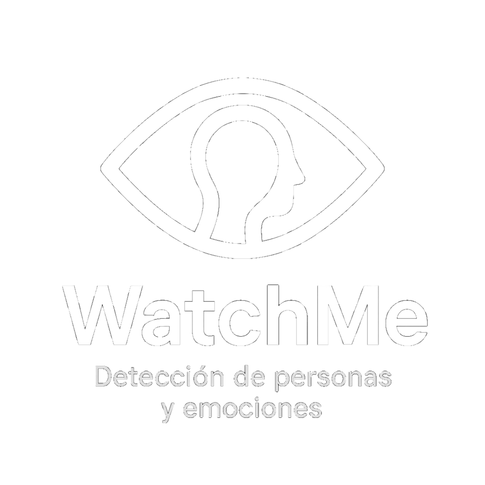

# WatchMe
*Detección de personas y emociones con MediaPipe y el sistema FACS.*
<p align="center">
    
</p>


## ¿Qué es WatchMe?

**WatchMe** es un prototipo desarrollado en **Python** que permite la **detección de rostros** y la **identificación de emociones** de forma **eficiente y ligera**, sin depender de modelos de aprendizaje profundo que consuman grandes recursos computacionales.

El programa utiliza:

- **[MediaPipe Face Mesh](https://chuoling.github.io/mediapipe/)** > para la detección y mapeo de 468 puntos faciales (landmarks) en 2D.
<p align="center">
    
</p>

- **[OpenCV](https://opencv.org/)** > para la captura de video desde la cámara, manipulación de frames y visualización.
<p align="center">
    
</p>


## Sistema de Detección de Emociones: **FACS**

### ¿Qué es FACS?

El **Facial Action Coding System (FACS)** es un estándar desarrollado por los psicólogos **Paul Ekman** y **Wallace V. Friesen** en 1978. Codifica **microexpresiones faciales** (llamadas *Action Units* o **AU**) que, en combinación, forman emociones reconocibles.

> Ejemplo:  
> `AU6 + AU12` > Elevación de mejillas + comisuras hacia arriba = **Felicidad**

### ¿Por qué FACS en lugar de redes neuronales?

Se decidió usar el sistema FACS ya que de esta forma se podría identificar de manera mucho más optima y sencilla (a través de los landmarks detectados por mediapipe) pequeñas micro expresiones las cuales en conjunto ayudarían a determinar la emoción presentada por el rostro que se allá detectado. Esto, sin la necesidad de usar demasiados recursos computacionales, lo cual haría que el programa fuera poco optimo ejecutarlo en computadoras modestas.


## Funcionamiento del Sistema FACS en WatchMe

### Paso 1: Detección del rostro con MediaPipe
Se procesa el frame en RGB y es pasado a MediaPipe para que devuelva los **468 landmarks** para el rostro detectado.

### Paso 2: Normalización espacial (para precisión)
Debido a la inconsistencia de los datos dependiendo de la distancia o ángulo de inclinación del rostro detectado, se implementa:

#### Recorte dinámico del rostro
```python
face_crop = frame[y_min:y_max, x_min:x_max]
```
> Se extrae solo la región del rostro.

#### Redimensión a lienzo fijo de **200x200**
```python
target_size = 200
scale = min(target_size / face_w, target_size / face_h)
resized_face = cv2.resize(face_crop, (new_w, new_h))
```

#### Normalización con distancia interocular
```python
# Datos para normalizar puntos
eyeL = pointsList[33]
eyeR = pointsList[263]
ref_dist = math.hypot(eyeR[0] - eyeL[0], eyeR[1] - eyeL[1])
```
> Todos los valores se expresan como **porcentaje relativo a la distancia entre ojos**, eliminando efectos de escala.

---

### Paso 3: Cálculo de microexpresiones (Action Units)

Se miden distancias entre **puntos clave** normalizados, tomando como base las siguientes métricasÑ

| Métrica                 | Puntos MediaPipe | Significado                    | AU (Action Unit)             |
| ----------------------- | ---------------- | ------------------------------ | ---------------------------- |
| `ceja_der`              | 65 → 158         | Altura de la ceja derecha      | AU1, AU2, AU4                |
| `ceja_izq`              | 295 → 385        | Altura de la ceja izquierda    | AU1, AU2, AU4                |
| `ancho_boca`            | 78 → 308         | Ancho de la boca               | AU12, AU15, AU20, AU23, AU26 |
| `alto_boca`             | 13 → 14          | Apertura vertical de la boca   | AU12, AU15, AU20, AU23, AU26 |
| `entrecejo`             | 8 → 168          | Arruga entre cejas (entrecejo) | AU4                          |
| `apertura_ojo_izq`      | 159 → 145        | Apertura del ojo izquierdo     | AU5, AU7                     |
| `apertura_ojo_der`      | 386 → 374        | Apertura del ojo derecho       | AU5, AU7                     |
| `elevacion_com_izq`     | 61 → 84          | Elevación comisura izquierda   | AU12, AU15                   |
| `elevacion_com_der`     | 291 → 314        | Elevación comisura derecha     | AU12, AU15                   |
| `pliegue_nas_izq`       | 220 → 305        | Pliegue nasolabial izquierdo   | AU6                          |
| `pliegue_nas_der`       | 440 → 75         | Pliegue nasolabial derecho     | AU6                          |
| `tension_menton`        | 18 → 175         | Tensión del mentón             | AU17                         |
| `elevacion_mejilla_izq` | 116 → 117        | Elevación mejilla izquierda    | AU6                          |
| `elevacion_mejilla_der` | 345 → 346        | Elevación mejilla derecha      | AU6                          |
| `contraccion_nariz`     | 19 → 20          | Contracción de la nariz        | AU9                          |
| `tension_labio_sup`     | 0 → 17           | Tensión del labio superior     | AU23, AU24                   |
| `tension_labio_inf`     | 18 → 175         | Tensión del labio inferior     | AU23, AU24                   |


> **Ejemplo**:  
> Si `ceja_der ≤ 15` y `ceja_izq ≤ 15` -> **Cejas bajadas** (AU4)

---

### Paso 4: Clasificación de emociones

La función `detect_emotion_facs(metrics)` evalúa **combinaciones de AUs** para determinar la emoción dominante:

```python
if (elevacion_mejilla_izq >= 9 and ... and ancho_boca > 50):
    return 'Feliz', (0, 255, 255)
```

#### Lista de emociones detectadas:
| Emoción       | Color BGR       | AUs principales |
|---------------|------------------|------------------|
| Feliz         | `(0, 255, 255)`  | AU6 + AU12       |
| Sonriente     | `(255, 205, 0)`  | AU6 + AU12 (leve)|
| Tristeza      | `(0, 100, 255)`  | AU1 + AU4 + AU15 |
| Enojo         | `(0, 0, 255)`    | AU4 + AU5 + AU7 + AU23 |
| Miedo         | `(128, 0, 128)`  | AU1+2 + AU5 + AU20 |
| Asombro       | `(0, 255, 255)`  | AU1+2 + AU5 + AU26 |
| Desagrado     | `(0, 255, 0)`    | AU9 + AU15 + AU16 |
| **Neutral**   | `(255, 255, 255)`| Ninguna combinación |

---

## Visualización en Tiempo Real

### Rostro recortado (esquina inferior derecha)
Se muestra en **escala de grises** con la respectiva **malla facial** dibujada (FACEMESH_TESSELATION). Siempre en un lienzo de **200x200**.


### Etiqueta de emoción
```python
putText_face = f"[+]: {emotion}"
cv2.putText(frame, putText_face, (int(...), int(...)), cv2.FONT_HERSHEY_SIMPLEX, 1, color, 3)
```
> Esta etiqueta se coloca sobre la frente del usuario detectado.

### Gráficas
Son un total de 7 barras horizontales (una por emoción) las cuales poseen un nivel de activación basado en **promedio normalizado de métricas relevantes** y lo cual ayuda a saber qué otras emociones está teniendo una persona y con qué intensidad.

> Cada gráfica tiene colores específicos para cada emoción.

## Estructura del Código
```text
watchme.py
├── Importación de librerías
├── Configuración de cámara (1280x720)
├── Inicialización de MediaPipe Face Mesh
├── Función: detect_emotion_facs(metrics)
├── Función: emotion_graphs(metrics, frame)
├── Bucle principal:
│   ├── Captura de frame
│   ├── Procesamiento con MediaPipe
│   ├── Recorte y escalado del rostro
│   ├── Normalización con distancia interocular
│   ├── Cálculo de 17 métricas FACS
│   ├── Detección de emoción
│   ├── Dibujo de gráficos y malla
│   └── Visualización con OpenCV
└── Liberación de recursos
```

### Dependencias:
- `opencv-python>=4.5`
- `mediapipe>=0.10.0`
- Python 3.8+
```bash
pip install -r requeriments.txt
```
> Funciona en **CPU** (no requiere GPU).


## Uso del Programa
1. Ejecutar:
   ```bash
   python watchme.py
   ```
2. La cámara se abrirá automáticamente.
3. Mira a la cámara. Se detectará tu rostro y emoción.
4. Presiona **`q`** para salir.


## Autor y Licencia
**WatchMe** es un proyecto open-source creado como prototipo académico/demostrativo.

> **Licencia**: Apache 2.0 License
> Autor: Crisstianpd
> Web: https://crisstianpd.vercel.app/


Si deceas seguir trabajando en este proyecto o solamente probarlo, eres libre de hacerlo.
