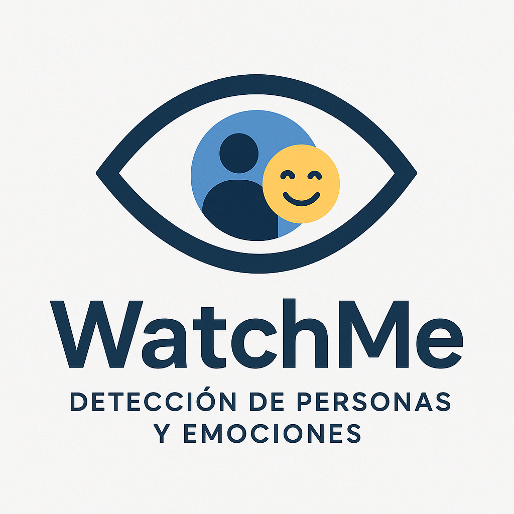
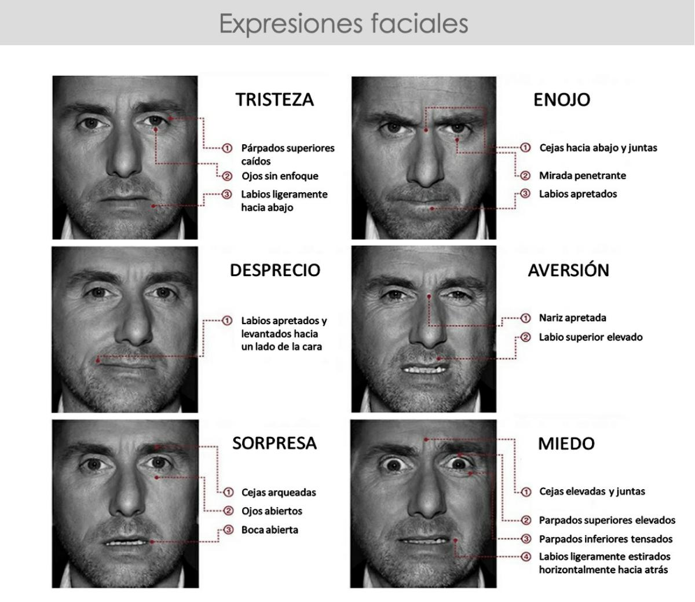

# WactheMe

WatchMe es un prototipo desarrollado para la detección de personas y emociones de una manera eficiente y rápida.

 

Este programa fue desarrollado bajo el lenguaje de programación Python y las librerías MediaPipe para la detección y cálculo de la maya de puntos correspondiente al rostro que se identifique, y OpenCV para poder trabajar con la cámara del dispositivo.

## Sistema FACS (Identificación de emociones)

Para la detección de emociones, se decidió realizar la implementación del Facial Action Coding System (FACS), el cual, es un sistema que codifica en pequeñas micro expresiones una emoción, desarrollado por los psicólogos Paul Ekman y Wallace V. Friesen.

Esto, ya que al hacer uso de redes neuronales o convolucionales sería muy costoso a nivel de recursos y potencia computacional, lo cual es algo que no nos conviene ya que queremos que el programa sea lo más optimo y accesible posible.

 

### Dentro del programa, este sistema funciona de la siguiente manera:

- Una vez que se ha detectado al rostro y MediaPipe ha hecho los cálculos correspondientes para aplicar la maya de puntos, a través de la distancia de ciertos puntos de interés, se podrán determinar micro expresiones, ya sea, por ejemplo, un levantamiento interior o exterior de la ceja.

- Luego se procede a comprobar si algunas micro expresiones en conjunto, cumplen ciertas condiciones para concluir en que el rostro está presentando una emoción en concreto.

## Ejemplo del funcionamiento del sistema FACS y MediaPipe
Se toman las distancias de los puntos `65` y `158` para la ceja derecha, y los puntos `295` y `385` para la ceja izquierda.

 

En caso de que la distancia entre estos dos grupos de puntos sea menor o igual a 15, quiere indicar que la persona tiene sus dos cejas (derecha e izquierda) hacia abajo. Esta será una micro expresión.

 

Y en caso de que estas dos micro expresiones en conjunto con otras, lleguen a coincidir con las micro expresiones que forman una cierta emoción, se determinara que dicha emoción detectada es la que presenta el rostro.

 

## Extra del programa

Al trabajar con distancia entre puntos, se observaron irregularidades en estos valores dependiendo de la distancia a la que se encuentre el rostro en relación de la cámara. Por ello, se decidió hacer un recorte del frame que recolecta OpenCV a manera de que este recorte, mantenga al rostro siempre enfocado y abarcando todo el espacio dentro de un lienzo nuevo de 480x480.

 

De esta manera y con ayuda de otras técnicas como un suavizado por buffer y usando la distancia de los ojos como constante para normalizar los demás datos, se logró obtener valores, en relación con la distancia entre puntos, mucho mas precisos y que presentan la menor cantidad de cambios drásticos a la hora que el rostro este cerca, lejos o gire hacia un lado u otro.

 

Este proyecto, fue presentado para una feria de matemática dentro de mi institución educativa.
Es un trabajo que aún se puede mejorar, pero eso no quita que me siento muy feliz y orgulloso de lo que he logrado ya que el desarrollo de este me puso a prueba y que, a pesar de todas las complicaciones, lo logre concluir y obtener resultados muy buenos con respecto a rendimiento y precision de datos.

Todos lo interesados en seguirlo desarrollando, son libres de hacerlo.

Y si me desean apoyar, solo síganme en mis redes sociales.

¡Gracias por leer!
