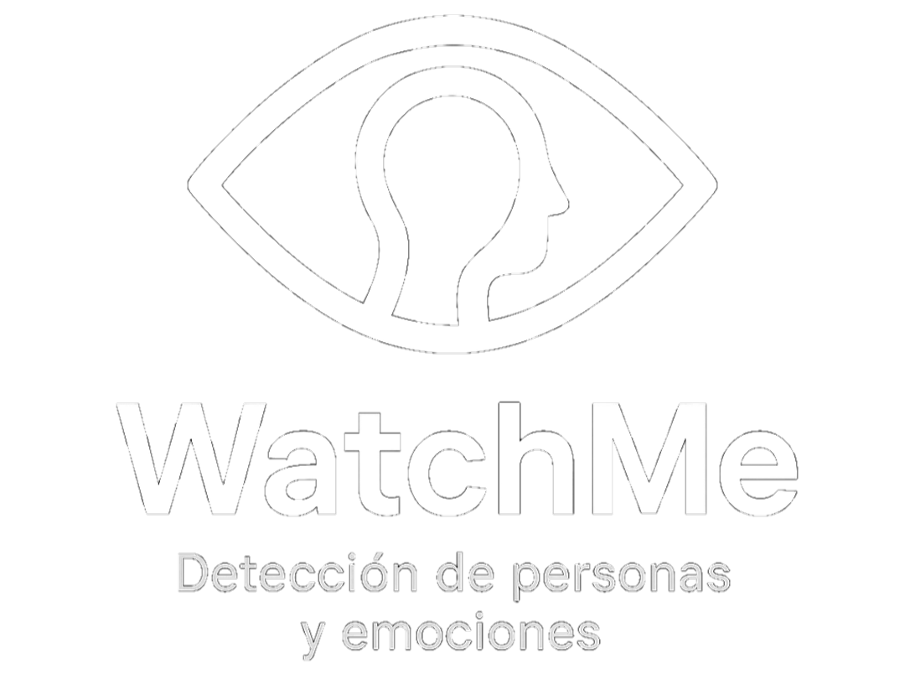

# WactheMe

WatchMe es un prototipo desarrollado para la detección de personas y emociones de una manera eficiente y rápida.

    

 

Este programa fue desarrollado bajo el lenguaje de programación Python y las librerías MediaPipe para la detección y cálculo de la maya de puntos correspondiente al rostro que se identifique, y OpenCV para poder trabajar con la cámara del dispositivo.

    
    

 

## Documentación en proceso
...

